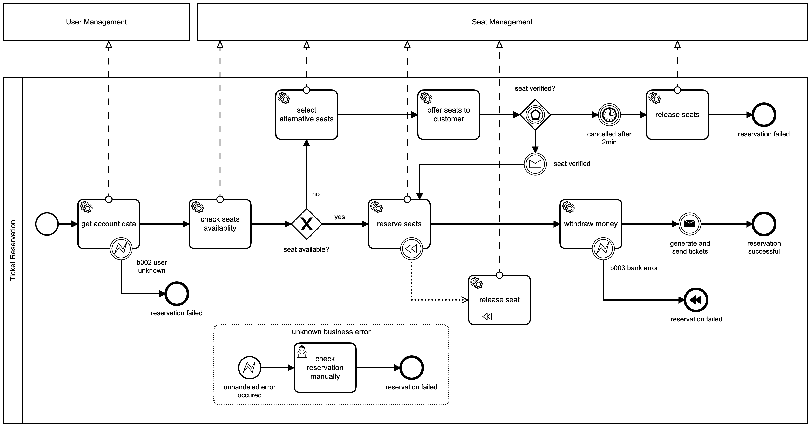

## BPMN Cinema
BPMN Cinema is a showcase for the different concepts in open source BPM engines:

- Error Handling
- Compensation
- Messages
- Timer
- Pools/Lanes
- Gateways
- Event Subprocess

### Versions
- SpringBoot 2.3
- Camunda 7.14
- H2 (in Memory DB) 1.4
- JDK 11
- ZXing (Zebra Crossing) 3.4 for QRCode generation
- Gradle 6.7

## Process Model

## How to run it
- start the application 
    - run `./gradlew bootRun` from your terminal
    - use your IDE to start the application
- go to `localhost:8087` to get to the camunda webapps
- use a REST client to make a reservation:
    - endpoint `localhost:8087/reservation`
    - POST request 
        - body: `{ "userId":"max.mustermann", "seats": [ "A1", "A2" ] }`
        - content-type: `application/json`
        - no auth necessary
- check the log output
